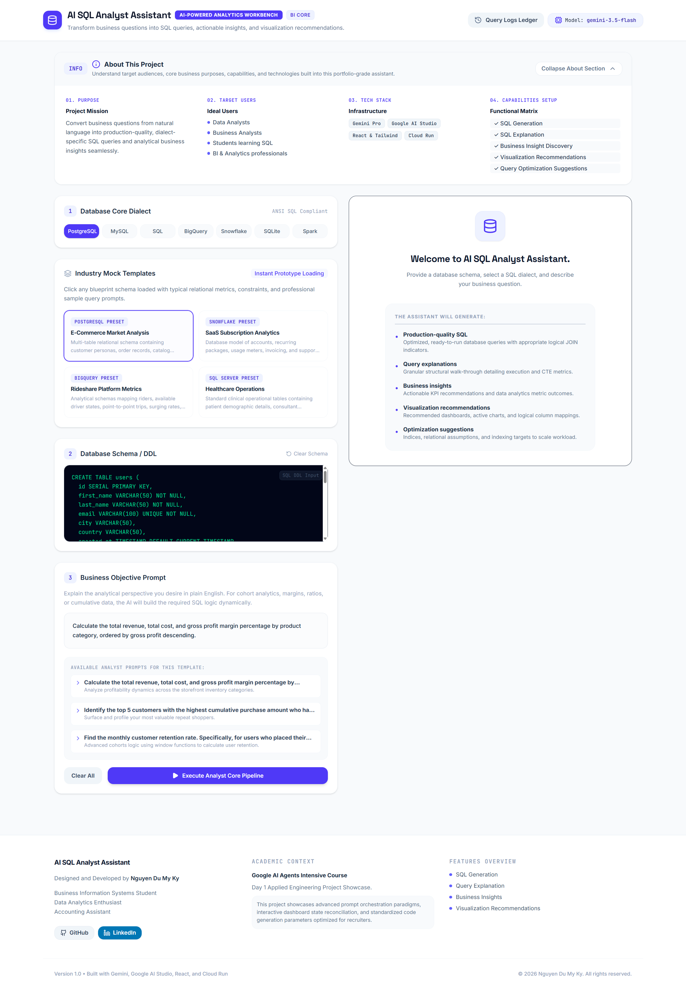
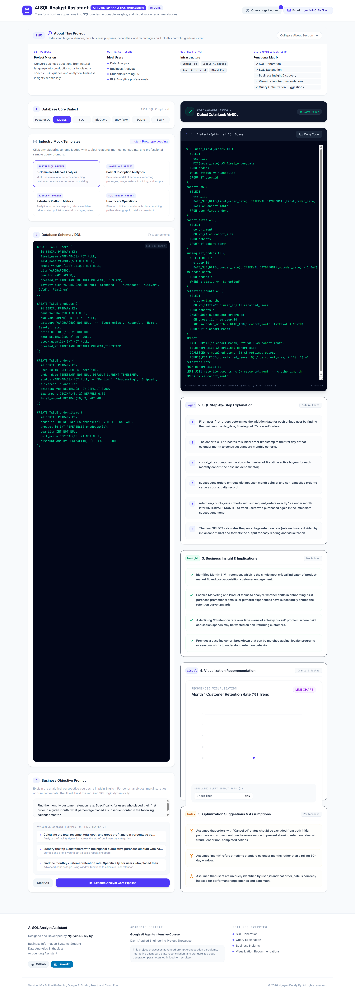

# AI SQL Analyst Assistant

The **AI SQL Analyst Assistant** is an intelligent web application designed to bridge the gap between natural language questions and database queries. Powered by Google's Gemini models, it transforms plain English business questions into optimized, dialect-specific SQL, offers detailed step-by-step logic explanations, provides strategic business insights, and renders dynamic dashboard visualizations with realistic mock datasets.

Live Demo:
https://ai-sql-analyst-assistant-567449380471.asia-southeast1.run.app

> [!WARNING]
> ⚠️ This demo may be temporarily unavailable if the Cloud Run service has been unpublished or suspended after course completion.

---

## Application Preview



---

## Project Overview

In many organizations, extracting data insights requires database technical knowledge (SQL) or relying on busy data teams, creating operational bottlenecks. The **AI SQL Analyst Assistant** was built to solve this problem by democratizing data access.

*   **What it does:** It acts as a virtual business intelligence analyst. Users input their database schema and ask a question in plain language; the assistant generates correct, ready-to-run SQL and maps the results to an interactive dashboard preview.
*   **Why it was built:** To demonstrate the practical deployment of structured AI model outputs for real-world analytical automation.
*   **Who it is for:** Non-technical business leaders seeking instant insights, and data analysts/developers looking to prototype SQL queries and dashboards rapidly.
*   **Business problem solved:** Eliminates latency in data decision-making, lowers the technical barrier to database querying, and assists in rapid schema reasoning.

---

## Features

*   **SQL Generation:** Instantly outputs production-grade SQL queries tailored to database dialects (PostgreSQL, MySQL, BigQuery, Snowflake, SQLite, Spark SQL, and SQL Server).
*   **SQL Explanation:** Deconstructs the generated SQL query statement step-by-step for educational review, code review, or debugging.
*   **Business Insight Discovery:** Evaluates the query's business objectives to synthesize implications, KPI interpretations, and critical decision-making support.
*   **Visualization Recommendations:** Automatically selects the most suitable chart style (Bar, Line, Area, or Pie) and builds a clean mock visualization to represent the data.
*   **Query Optimization Suggestions:** Recommends index creations, partitioning strategies, and database-specific query improvements.
*   **Industry Templates:** Includes pre-loaded schema presets and industry-focused questions (e.g., e-commerce retention, financial ledger, user engagement logs) for immediate experimentation.
*   **Query History Storage:** Tracks previously run schemas and analytical questions so you can easily compare and review outputs.

---

## Technology Stack

*   **Gemini:** Leverages `gemini-3.5-flash` model capabilities with JSON schema outputs to enforce response integrity.
*   **Google AI Studio:** Used for rapid prototyping of system instructions, API schema parameters, and credential management.
*   **React:** A responsive, interactive user interface built using React 19.
*   **TypeScript:** Type safety across both client-side components and server-side routes.
*   **Express:** A lightweight Node.js web server handling client requests and proxying Gemini AI API calls.
*   **Cloud Run:** Fully managed serverless container runtime hosting the production service with Google Cloud infrastructure.

---

## Example Workflow



### Step-by-Step Flow

1. User provides a database schema.
2. User submits a business question.
3. Gemini analyzes the schema and requirements.
4. SQL is generated.
5. Query logic is explained.
6. Business insights are generated.
7. Visualization recommendations are suggested.

---

## About This Project

This project was built during the **Google 5-Day AI Agents Intensive Course** (known colloquially as the *Intensive Vibe Coding Course*).

*   **Day 1 Topic:** Introduction to Agents & Vibe Coding

### Concepts Learned:
*   **Agentic Engineering:** Structuring system instructions and tools to build autonomous agents rather than simple chat loops.
*   **Vibe Coding:** Accelerating application creation through AI-assisted development of sophisticated features.
*   **Context Engineering:** Structuring database schemas and user queries inside system instructions to improve accuracy.
*   **AI Studio:** Configuring model behaviors, JSON schema definitions, and parameters interactively.
*   **Cloud Run Deployment:** Containers packaging Node.js backends and React frontends deployed serverless on Google Cloud Platform.

---

## Project Structure

```text
day01/ai-sql-analyst-assistant/
├── assets/                     # Application configurations
│   └── .aistudio/              # AI Studio app state
├── images/                     # Screenshot documentation assets
│   └── README.md               # Screenshot placeholder instructions
├── src/                        # React Frontend Source Code
│   ├── components/
│   │   └── InteractiveChart.tsx # SVG/HTML dashboard chart engine
│   ├── App.tsx                 # Core UI dashboard layout & state
│   ├── index.css               # Styling tokens and Tailwind imports
│   ├── main.tsx                # Client-side React entry point
│   ├── presets.ts              # Pre-loaded database schemas & queries
│   └── types.ts                # TypeScript interfaces and schemas
├── .env.example                # Sample environment variables template
├── .gitignore                  # Git ignore definitions
├── index.html                  # Main client-side HTML shell
├── metadata.json               # Course app metadata details
├── package.json                # Project scripts and dependencies
├── README.md                   # Project documentation (this file)
├── server.ts                   # Express server with Gemini API backend integration
├── tsconfig.json               # TypeScript compiler config
└── vite.config.ts              # Vite asset bundler configuration
```

---

## Local Setup

### Prerequisites
Ensure you have **Node.js 18+** installed on your machine.

### 1. Install Dependencies
Navigate to the project directory and install requirements:
```bash
npm install
```

### 2. Configure Environment Variables
Create your local environment file:
```bash
cp .env.example .env
```
Open the `.env` file and insert your Gemini API Key:
```env
GEMINI_API_KEY=your_api_key_here
```
> [!TIP]
> You can acquire a free development API key from [Google AI Studio](https://aistudio.google.com/).

### 3. Run the Development Server
```bash
npm run dev
```
Open your browser and visit [http://localhost:3000](http://localhost:3000).

---

## Future Improvements

*   **Database Connections:** Connect to actual read-only database connections (PostgreSQL, SQLite, MySQL) to run the generated SQL query in real-time.
*   **Query Execution:** Fetch real dataset samples directly from database connections and feed them to the dashboard chart instead of generating mock datasets.
*   **Authentication:** Implement secure user registration, session tracking, and project workspaces.
*   **MCP Integration:** Introduce Model Context Protocol (MCP) to query remote databases, file systems, and enterprise data warehouses natively.
*   **Multi-Agent Workflows:** Combine a SQL generation agent with a distinct data auditing agent and an automated executive summarization agent.
*   **Advanced Analytics:** Use larger model contexts to suggest database refactoring, partitioning keys, and indexing architectures automatically.

---

## Author

*   **Nguyen Du My Ky**
    *   *Business Information Systems Student*
    *   *Data Analytics Enthusiast*
    *   *Accounting Assistant*
