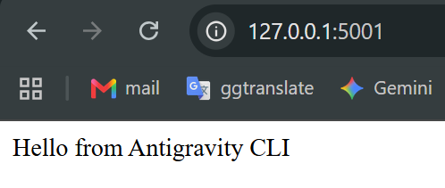
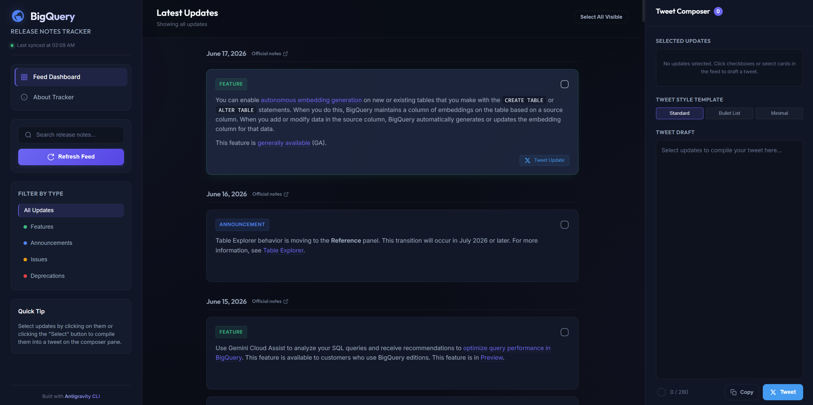
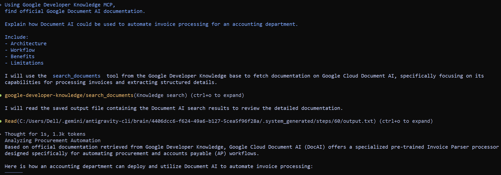

# Google Antigravity AI Agents: CLI & MCP Tool Integration

This repository showcases interactive projects, tools development, and foundational protocol architectures explored during Day 2 of the Google AI Agents program. The exercises demonstrate the setup and usage of the Antigravity CLI and the Model Context Protocol (MCP) to access Google Developer Knowledge.

---

## 🎯 Day 2 Overview

Day 2 focuses on extending agent capabilities beyond isolated chat loops by integrating command-line interfaces and standardized protocols to access live system state, official document indexes, and external tool suites. 

### Core Codelabs Completed:
1.  **Getting Started with Antigravity CLI:** Workspace authentication, secure execution sandboxes, agent TUI visualization, and artifact approval workflows.
2.  **Google Developer Knowledge MCP Server:** Integration with Google's remote Model Context Protocol endpoint to query authoritative cloud documentation and automate cloud actions.

---

## 🛠️ Codelab 1 – Antigravity CLI (`agy`)

The **Antigravity CLI (`agy`)** serves as the developer agentic control interface for workspace orchestrations.

*   **OAuth Authentication:** Integrates direct Google OAuth verification for secure user session initialization.
*   **Secure Sandboxing:** Commands are parsed and executed within a trusted virtual environment to prevent unauthorized local system mutations.
*   **Artifact Review System:** Supports human-in-the-loop validation of generated code artifacts prior to system changes.

### Hello from Antigravity CLI
A verification exercise establishing a local Flask microservice on port `5001` to test secure agent-to-environment connectivity.



### BigQuery Release Notes Tracker
A dark-mode analytics dashboard (running on port `5000`) designed to monitor BigQuery updates in real-time. It groups releases dynamically (Features, Deprecations, Issues) and features an interactive tweet compiler with character tracking for social sharing.



---

## 🔌 Codelab 2 – Google Developer Knowledge MCP

Connecting AI models directly to static indexes leads to outdated guidance. The **Model Context Protocol (MCP)** standardizes how agents interact with external data sources and developer tools.

### What is MCP?
MCP is an open standard that acts as a universal context connector (the "USB-C port" of AI context). It provides a unified protocol for agents to query local and remote databases, retrieve documentation, execute terminal actions, and interface with APIs securely.

### Why MCP Matters for AI Agents
Rather than developing fragile, custom API integrations for every tools suite, agents utilizing MCP can discover, inspect, and invoke tools dynamically. This separation of concerns lets agents execute complex operations while maintaining strict host control.

### Model Knowledge vs. MCP-powered Retrieval
*   **Model Knowledge:** Static, frozen at the model's training cutoff date. It struggles with API version updates, deprecations, and newly released libraries.
*   **MCP-powered Retrieval:** Dynamic and authoritative. Using tools like `search_documents`, the agent retrieves up-to-date, official documentation directly from Google's Developer Knowledge index at runtime.

### Screenshot – Google Developer Knowledge MCP



*Using the Google Developer Knowledge MCP server to retrieve official Google Cloud documentation and generate accounting automation guidance based on authoritative sources.*

---

## 💼 Practical MCP Example: Document AI for Invoice Processing

A real-world business application researched and designed using the Google Developer Knowledge MCP server is an automated accounting pipeline:

```text
[Invoice Ingestion] 
       ↓
[Document AI Extraction] (Extracts invoice_id, vendor, total_amount, tax)
       ↓
[Human-in-the-Loop Review] (Flags anomalies or low confidence scores)
       ↓
[ERP Integration] (Pushes structured data to SAP, Oracle, or QuickBooks)
       ↓
[BigQuery Analytics] (Runs financial forecasting and spend audits)
```

### Core Architecture Stages:
*   **Invoice Ingestion:** Scans incoming documents from Google Drive folders or email attachments.
*   **Document AI Extraction:** Processes PDFs using pre-trained Google Document AI processors (Invoice Parser) to extract key-value fields such as supplier names, invoice dates, line items, and totals.
*   **Human-in-the-Loop Review:** Routes extractions with low confidence scores or discrepancy flags to a verification dashboard for manual validation.
*   **ERP Integration:** Pushes audited, structured accounting data directly to Enterprise Resource Planning (ERP) ledgers.
*   **BigQuery Analytics:** Streams data into BigQuery for real-time cost auditing, tax reporting, and historical trend analysis.

---

## 🧬 Google Antigravity Agent Protocol Stack

The Antigravity ecosystem operates on a standard suite of five open protocols to enable autonomous machine-to-machine transactions and services:

1.  **A2UI (Agent-to-User Interface):** Dynamically renders native, interactive dashboard widgets and visualization metrics directly to users.
2.  **A2A (Agent-to-Agent):** Standardizes cross-agent discovery and collaboration workflows.
3.  **MCP (Model Context Protocol):** Provides standardized context retrieval, filesystem access, and API executions.
4.  **AP2 (Agent Payments):** Enforces spending rules, budget authorization checks, and cryptographically signed audit logs.
5.  **UCP (Universal Commerce Protocol):** Standardizes shopping, checkout, and inventory verification in machine-to-machine marketplaces.

---

## 💡 Key Takeaways from Day 2

*   **Plan Before Action:** Standardizing execution planning before modifying workspace files prevents configuration errors.
*   **External Interoperability:** Integrating MCP changes agents from text predictors into action-oriented systems.
*   **Authoritative Documentation Access:** Accessing official search indexes on-demand prevents AI hallucinations and ensures API compatibility.
*   **Interoperable Power:** Standardizing protocols (A2A, MCP, A2UI) enables seamless agent delegation.
*   **Human Verification:** Maintaining human-in-the-loop authorization gates remains critical for safety and system integrity.

---

## 📂 Project Structure

```text
day02/
├── projects/
│   ├── bigquery-release-notes-tracker/
│   │   ├── app.py                # Flask release dashboard & parser
│   │   ├── hello_app.py          # Verification web portal (Port 5001)
│   │   ├── static/               # Client styling and interaction logic
│   │   └── templates/            # HTML structural pages
│   ├── news.txt                  # Raw news text file used in CLI tasks
│   └── summary.txt               # AI-summarized output of news text
├── screenshots/
│   ├── hello-flask-app.png       # Hello Flask UI verification output
│   ├── bigquery-release-tracker.png # BigQuery Release Dashboard interface
│   ├── artifact-review.png       # TUI/IDE Artifact review checkpoint UI
│   └── mcp-document-ai-accounting.png # MCP tool usage output
├── upload_to_drive.py            # Google Drive upload script generated via MCP
└── README.md                     # Project documentation (this file)
```

---

## 🖥️ Local Setup

### 1. Install Dependencies
Ensure you have Python 3.10+ installed. Install the Python requirements inside a virtual environment:
```bash
cd projects/bigquery-release-notes-tracker
python -m venv .venv
source .venv/bin/activate  # Or `.venv\Scripts\activate` on Windows
pip install -r requirements.txt
```

### 2. Run the Projects
To run the BigQuery Release Tracker:
```bash
python app.py
```
To run the Hello microservice:
```bash
python hello_app.py
```

### 3. Environment Configuration
Ensure your environment has access to credentials:
```env
GEMINI_API_KEY=your_api_key_here
```

---

## 🔮 Future Improvements

*   **Automated Document AI Processor Management:** Enable the agent to create and configure Document AI processors dynamically via MCP.
*   **Bi-directional ERP Syncing:** Implement writeback adapters to confirm invoice entry updates in ERP platforms.
*   **Production Deployment:** Containerize the Flask dashboards and deploy to Cloud Run with Identity-Aware Proxy (IAP) protections.

---

## 👤 Author

**Nguyen Du My Ky**  
*   Business Information Systems Student  
*   Data Analytics Enthusiast  
*   Accounting Assistant  
