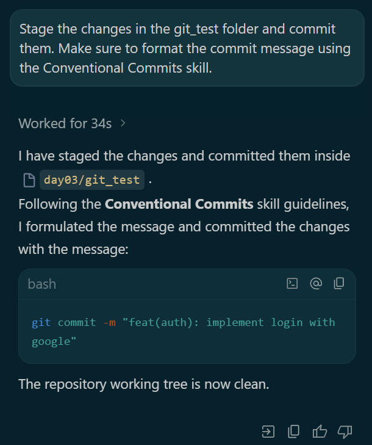
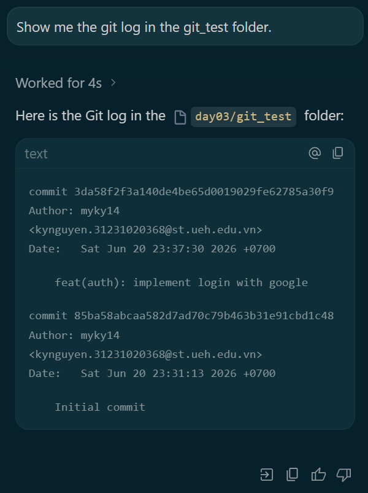
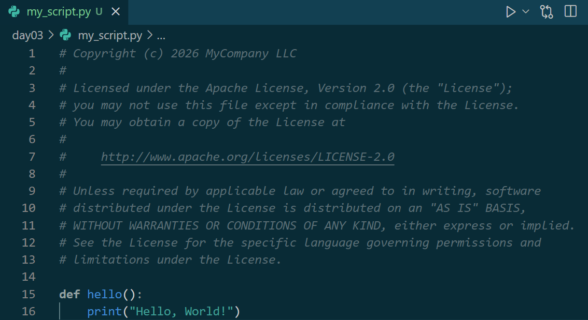
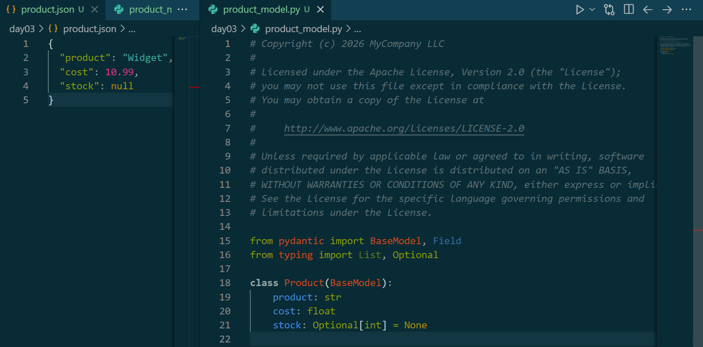
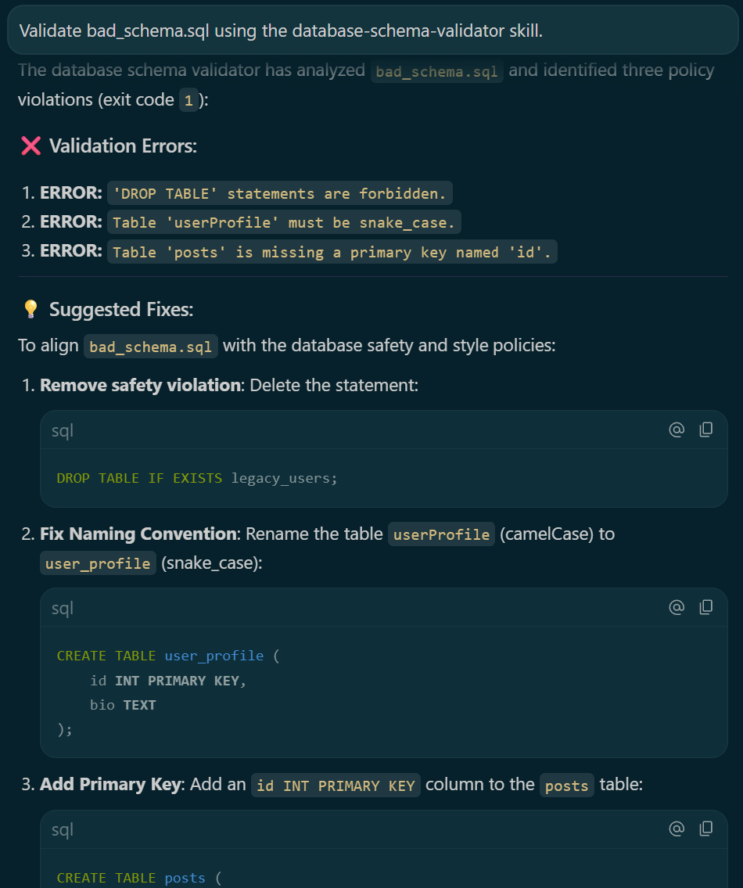

# Google Antigravity AI Agents: Agent Skills

This repository showcases the projects, tools development, and design patterns explored during **Day 3** of the Google AI Agents program, focusing on building and using **Agent Skills** within the Antigravity ecosystem.

### 📊 Day 3 Progress
*   ✅ Level 1 – Instruction Pattern
*   ✅ Level 2 – Reference Pattern
*   ✅ Level 3 – Few-Shot Pattern
*   ✅ Level 4 – Workflow Orchestration (Completed)

---

## 🎯 Day 3 Overview & Purpose

**Agent Skills** represent a key architectural design pattern for building scalable, reliable, and domain-specialized AI systems.

### Why Skills Exist
AI agents are generalists by default. However, in production environments, generalist behavior often leads to unpredictability, formatting errors, or rule violations. **Skills** solve this by packaging specialized behavior, instructions, templates, few-shot learning examples, and validation scripts into reusable, self-contained directories. This allows the agent to route specific natural language requests to tailored workflows, guaranteeing consistent, domain-specific outputs.

### Difference between Skills and MCP (Model Context Protocol)
*   **Model Context Protocol (MCP):** Acts as the standardized connection mechanism (the "USB-C port" of AI context) that allows an agent to access external tools, services, and databases (e.g., querying Google Developer Knowledge, reading databases, or writing files).
*   **Agent Skills:** Represent encapsulated *behavior, instructions, and cognitive workflows* (e.g., formatting commits, injecting licenses). MCP connects the agent to **what** it can access and do, while Skills dictate **how** the agent processes tasks.

### Reducing Context Overload & Context Rot
Carrying a massive, monolithic system prompt containing instructions for every possible tool and coding rule rapidly consumes the LLM's context window. This leads to **Context Overload** (increased latency and token costs) and **Context Rot** (where the model hallucinates or ignores rules due to attention degradation).

Skills mitigate this through **Progressive Disclosure**. Because skills are structured as modular directories, instructions are loaded **only when the specific skill is activated** by a matching natural language intent. This keeps the active context window lightweight, clean, and highly focused on the task at hand.

---

## 📈 Agent Skills Progression

The skill architecture progresses through levels of increasing design sophistication:

*   **Level 1: Instructions** (e.g., `git-commit-formatter`) ➔ Pure instructions-based behavior. The agent follows explicit directives.
*   **Level 2: References** (e.g., `license-header-adder`) ➔ Resource isolation. The agent reads external templates, dynamically converting or injecting content on-demand.
*   **Level 3: Examples** (e.g., `json-to-pydantic`) ➔ Few-shot learning. The agent infers transformation patterns from positive examples instead of relying on long text instructions.
*   **Level 4: Workflow Orchestration** (e.g., `database-schema-validator`) ➔ Scripted/algorithmic multi-step procedures. The agent coordinates tool calls, runs external scripts, parses output, and handles remediation workflows.

As we scale from Level 1 to Level 4, the agent transitions from static instruction-following to intelligent reasoning and multi-tool orchestration, enabling robust automation of complex engineering standards.

---

## 🛠️ Level 1 – Instruction Pattern

### `git-commit-formatter`
*   **Concept:** Pure instruction-based specialization.
*   **Implementation:** The skill contains reusable commit formatting instructions inside a declarative `SKILL.md` file. When the developer requests a git commit, the agent automatically intercepts the request, runs a git diff, formats the change as a Conventional Commit (e.g., `feat(auth): ...`), and executes the commit.
*   **Takeaway:** This demonstrates how specific behavior can be packaged into reusable Skills rather than overloading the agent's main system prompt.

### Conventional Commit Generation
The agent successfully intercepted code modifications and generated a Conventional Commit message following Git best practices.



*Caption: The git-commit-formatter skill generated a Conventional Commit message following Git best practices.*

### Git Log Verification
Verifying the repository history confirms that the Conventional Commit was successfully recorded.



*Caption: Verification of repository history after applying the skill-generated commit workflow.*

---

## 🛠️ Level 2 – Reference Pattern

### `license-header-adder`
*   **Concept:** Specialization using external asset utilization.
*   **Implementation:** Instead of embedding large templates inside instructions, the skill loads external reference content from `resources/HEADER_TEMPLATE.txt`. The agent reads the template, dynamically converts the block syntax to the target language-specific comment style (e.g., `#` for Python), and prepends it to the newly created source file.
*   **Takeaway:** This demonstrates **Progressive Disclosure** in action. Large static content is isolated in a separate resource folder and only loaded by the agent when required, preserving the model's active context window.

### License Header Injection
The skill retrieved a reusable template and automatically prepended the converted Python comment header to a newly created file.



*Caption: The license-header-adder skill retrieved a reusable license template and automatically inserted the appropriate Python comment header into a newly created source file.*

---

## 🛠️ Level 3 – Few-Shot Pattern

### `json-to-pydantic`
*   **Concept:** Example-based learning rather than relying solely on written instructions (Few-Shot Pattern).
*   **Implementation:** The skill's `examples/` folder contains a pairing of `input_data.json` and `output_model.py`. The agent learns the desired transformation pattern by studying this example pair.
*   **Workflow:**
    `JSON Input` ➔ `Example Reference` ➔ `Type Inference` ➔ `Pydantic Model Generation`
*   **Key Concepts:**
    *   **Few-Shot Learning:** Guiding agent behavior through concrete examples.
    *   **Pattern Matching:** Aligning inputs and outputs to discern transformation rules.
    *   **Type Inference:** Determining appropriate Python types from JSON values.
    *   **Structured Code Generation:** Creating clean, syntactically valid Pydantic models automatically.

### Practical Example Summary
The [product.json](file:///f:/Studyspace/AI_Agents_5_Day_Google/day03/product.json) file containing raw JSON data:
```json
{
  "product": "Widget",
  "cost": 10.99,
  "stock": null
}
```
was successfully transformed into a strongly typed Pydantic model in [product_model.py](file:///f:/Studyspace/AI_Agents_5_Day_Google/day03/product_model.py).

**Key Transformations Highlighted:**
*   **`string` ➔ `str`**: The product name field was typed as a string.
*   **`number` ➔ `float`**: The cost field was mapped to a float.
*   **`null` ➔ `Optional[...]`**: The stock field (null) was correctly resolved as optional (mapped to `Optional[int] = None`).
*   **Automatic Class Generation**: A complete Pydantic model class was generated with correct imports.

### JSON to Pydantic Conversion
The `json-to-pydantic` skill converted raw JSON data into a strongly typed Pydantic model by following example-based patterns stored within the skill.



*Caption: The json-to-pydantic skill converted raw JSON data into a strongly typed Pydantic model by following example-based patterns stored within the skill.*

---

## 🛠️ Level 4 – Workflow Orchestration Pattern

### `database-schema-validator`
*   **Concept:** Scripted/algorithmic multi-step procedures (Workflow Orchestration Pattern).
*   **Implementation:** Unlike simple instruction-based skills, this pattern orchestrates a multi-step verification and reasoning workflow. The agent dynamically loads rules, invokes an external Python validation tool against the user's schema, interprets the execution output, and formats actionable errors/suggested fixes.
*   **Workflow:**
    ```mermaid
    flowchart LR
        A[Schema File] --> B[Validation Rules]
        B --> C[Policy Checks]
        C --> D[Error Detection]
        D --> E[Suggested Fixes]
    ```

### Validation Results & Engineering Significance
In our test execution against `bad_schema.sql`, the validator detected three distinct policy violations:
1.  **Forbidden `DROP TABLE` Statement:** The file contained `DROP TABLE IF EXISTS legacy_users;`. 
    *   *Why it matters:* In production databases, accidental table drops can cause catastrophic data loss. Automated schema validation prevents destructive commands from executing during migrations.
2.  **Naming Convention Violation:** The table `userProfile` violated the `snake_case` rule.
    *   *Why it matters:* Consistent naming standards (e.g., lowercase snake_case) ensure database portability across different SQL engines and ease integration with Object-Relational Mappers (ORMs).
3.  **Missing Primary Key:** The `posts` table was defined without an `id` column or PRIMARY KEY.
    *   *Why it matters:* Primary keys are fundamental for indexing, maintaining relational integrity, and enabling efficient queries. Omitting them degrades query performance and violates standard relational design rules.

### Database Schema Validation
The `database-schema-validator` skill analyzed the SQL schema, identified safety and style violations, and generated recommended fixes based on predefined governance rules.



*Caption: The database-schema-validator skill analyzed a SQL schema, identified policy violations, and generated recommended fixes based on predefined governance rules.*

---

## 💡 Key Learnings So Far

*   **Reusable Expertise:** Skills package reusable expertise and tools in self-contained folders, making them highly portable across projects.
*   **Declarative Instructions:** Instructions are stored cleanly in a declarative `SKILL.md` file instead of repeating prompts in chat sessions.
*   **Context Isolation:** Moving large static content (e.g., code templates, dictionaries) into a `resources/` folder reduces initial prompt size.
*   **Few-Shot Power:** Few-shot examples often outperform long textual instructions in guiding LLM outputs.
*   **Pattern Learning:** Agent Skills can teach complex transformation patterns through concrete examples.
*   **Ambiguity Reduction:** Providing input/output examples reduces ambiguity and improves agent consistency.
*   **Structured Behavior:** Structured examples are powerful tools for building reusable and reliable agent behavior.
*   **Workflow Coordination:** Workflow-based skills can coordinate multiple validation, execution, and reasoning steps seamlessly.
*   **Organizational Governance:** Skills can programmatically encode organizational governance, security guardrails, and engineering standards.
*   **Operational Workflows:** Agent Skills evolve capability execution from simple prompting to reusable operational workflows.
*   **Consistency & Quality:** Structured workflows improve the consistency, reliability, and maintainability of agentic tasks.
*   **Efficiency:** Progressive Disclosure improves context window utilization, reduces token costs, and prevents Context Rot.
*   **Scalability:** Structuring capabilities as isolated skills makes agents significantly easier to test, maintain, and scale.

---

## 📂 Project Structure

```text
day03/
├── .agents/
│   └── skills/
│       ├── database-schema-validator/ # Level 4 Schema Validator Skill
│       ├── git-commit-formatter/      # Level 1 Commit Formatter Skill
│       ├── json-to-pydantic/          # Level 3 JSON-to-Pydantic Skill
│       └── license-header-adder/      # Level 2 License Header Skill
├── antigravity-skills/                # Cloned upstream skills repo
├── git_test/                          # Test repository for git-commit-formatter
├── screenshots/                       # Run-time execution screenshots
│   ├── skill-conventional-commit.png
│   ├── skill-database-schema-validator.png # Level 4 verification output
│   ├── skill-git-log-verification.png
│   ├── skill-json-to-pydantic.png     # Level 3 verification output
│   └── skill-license-header-adder.png # Level 2 verification output
├── bad_schema.sql                     # Test schema file for validation
├── my_script.py                       # Python file updated using license-header-adder
├── product.json                       # Raw JSON data source for Level 3
├── product_model.py                   # Pydantic model generated via Level 3 skill
└── README.md                          # Day 3 documentation (this file)
```

---

## 👤 Author

**Nguyen Du My Ky**  
*   Business Information Systems Student  
*   Data Analytics Enthusiast  
*   Accounting Assistant  
