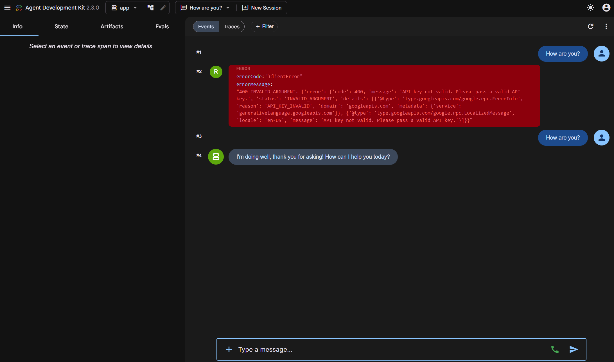
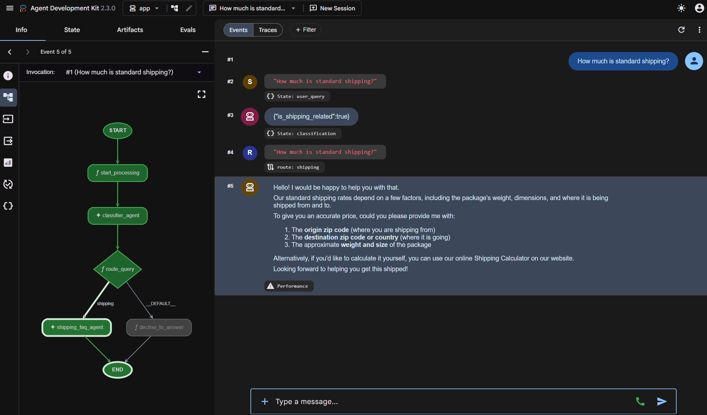
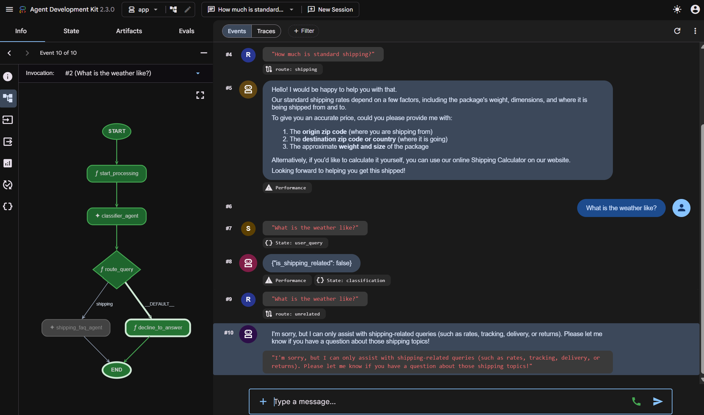
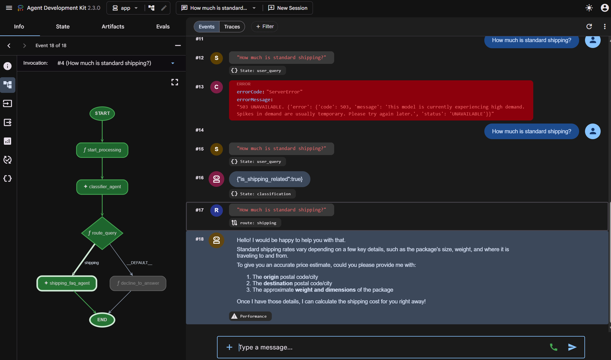

# Google AI Agents: Agent Skills & Graph Workflows (Day 3)

This repository documents my progress, projects, and key architectural patterns explored on **Day 3** of the Google AI Agents program. Today's work focused on building modular **Agent Skills** and orchestrating **Graph Workflows** using the Agent Development Kit (ADK) 2.0.

### 📊 Day 3 Progress
*   ✅ **Codelab 1: Agent Skills**
    *   ✅ Level 1 – Instruction Pattern (`git-commit-formatter`)
    *   ✅ Level 2 – Reference Pattern (`license-header-adder`)
    *   ✅ Level 3 – Few-Shot Pattern (`json-to-pydantic`)
    *   ✅ Level 4 – Workflow Orchestration (`database-schema-validator`)
    *   ✅ Installed Agents CLI Skills & Weather Assistant Prototype
*   ✅ **Codelab 2: Agents CLI & ADK 2.0**
    *   ✅ Created `customer-support-agent` using ADK 2.0 Graph Workflow
    *   ✅ Configured local running with `GEMINI_API_KEY` (decoupled GCP ADC)
    *   ✅ Verified routing logic for shipping queries vs unrelated queries
    *   ✅ Tested real-time hot reload behavior in the ADK Playground
*   ⏳ **Day 4 Pending**
*   ⏳ **Day 5 Pending**
*   ⏳ **Capstone Pending**

---

## 🎯 Day 3 Overview

Today's core objective was moving from single-prompt LLM interactions to modular, reusable agent components. We built **Agent Skills**—specialized behaviors packaged with instructions, references, examples, and tools—and integrated them into structured **Graph Workflows** using ADK 2.0 to handle real-world business routing.

---

## 🧠 Key Concepts

*   **Agent Skills**: Encapsulated directories holding a `SKILL.md` instruction file, template resources, examples, and validation scripts. They turn prompt engineering into structured developer workflows.
*   **Context Overload & Context Rot**: As system prompts grow with too many rules, model latency increases (Context Overload) and the LLM's instruction-following degrades (Context Rot).
*   **Progressive Disclosure**: Loading instructions, examples, and resources dynamically only when the matching skill is triggered. This keeps the LLM's active context window lightweight and focused.
*   **Agent Development Kit (ADK)**: Google's Python framework that provides structure for building production-ready, multi-agent, and tool-augmented applications.
*   **Agents CLI**: Command-line interface (`agents-cli`) that automates scaffolding, local testing, validation, and deployment of ADK agents.
*   **Graph Workflow**: Graph-based execution model where nodes do work, edges define connections, and conditional routing is guided by event states.

---

## 🛠️ Codelab 1: Agent Skills

We developed and verified a four-level progression of agent skills to enforce development standards:

### Level 1: Instruction Pattern (`git-commit-formatter`)
*   **Concept**: Direct instruction enforcement.
*   **Implementation**: Instructs the agent to analyze `git diff` and format changes as Conventional Commits.
*   **Verification**: Generated and recorded clean, standard commit history in the repo.

### Level 2: Reference Pattern (`license-header-adder`)
*   **Concept**: Resource isolation using external assets.
*   **Implementation**: Moves large comment headers into a separate template file (`resources/HEADER_TEMPLATE.txt`) and dynamically converts/prepends them to new source files based on the target programming language.
*   **Benefit**: Saves context window space by only loading templates when needed.

### Level 3: Few-Shot Pattern (`json-to-pydantic`)
*   **Concept**: Guiding LLM transformations through input-output examples.
*   **Implementation**: Provides JSON-to-Pydantic mappings inside `examples/` for the model to study, enabling accurate type inferences (e.g., mapping `null` to `Optional[...]`).
*   **Benefit**: Concrete examples resolve format ambiguity better than text instructions.

### Level 4: Workflow Orchestration (`database-schema-validator`)
*   **Concept**: Algorithmic multi-step execution.
*   **Implementation**: Runs a schema check script, parses the errors, identifies SQL policy violations (such as `DROP TABLE` statements or missing primary keys), and returns structured remediation suggestions to the user.

---

## 🤖 Codelab 2: Agents CLI & ADK 2.0

We built a prototype **`customer-support-agent`** using ADK 2.0's Graph Workflow engine.

### Project Scaffolding
Scaffolded a clean local prototype:
```bash
uvx google-agents-cli scaffold create customer-support-agent --agent adk --prototype
```
This created a directory layout containing:
*   `app/agent.py`: Graph definition and node functions.
*   `app/fast_api_app.py`: FastAPI server integration.
*   `pyproject.toml`: Dependency and script management.

### [agent.py](file:///f:/Studyspace/AI_Agents_5_Day_Google/day03/customer-support-agent/app/agent.py) Structure

*   **Nodes**: Functions or LLM agents executing work.
    1.  `start_processing`: Stores the user's initial query in context state.
    2.  `classifier_agent`: An `LlmAgent` using a Pydantic schema to output if the query is shipping-related.
    3.  `route_query`: Inspects the classification result and determines routing.
    4.  `shipping_faq_agent`: Answers shipping FAQs with high enthusiasm and emojis.
    5.  `decline_to_answer`: Declines unrelated questions politely.
*   **Edges & Root Workflow**: Connected via `Workflow` using a `RoutingMap` dictionary:
    ```python
    edges=[
        ('START', start_processing),
        (start_processing, classifier_agent),
        (classifier_agent, route_query),
        (route_query, {
            "shipping": shipping_faq_agent,
            "__DEFAULT__": decline_to_answer,
        }),
    ]
    ```

### Local Playgrounds and Hot Reloading
*   **ADK Playground**: Launched locally on `http://127.0.0.1:8080` to chat with the agent and observe real-time node outputs.
*   **Hot Reload**: Tested updating instructions for `shipping_faq_agent` in `agent.py`. The playground immediately picked up the updates, producing highly enthusiastic responses detailing our free shipping threshold for orders over `$50`.

---

## 📸 Screenshots

### Codelab 1: Agent Skills

#### Level 1: Git Conventional Commit Formatter

*Caption: Git Commit Formatter generating a standardized conventional commit.*

#### Level 1: Git Log Verification

*Caption: Verifying repository commit history.*

#### Level 2: License Header Adder

*Caption: Prepending license templates dynamically to files.*

#### Level 3: JSON to Pydantic Converter

*Caption: Transforming raw JSON structures into strongly typed Pydantic models.*

#### Level 4: Database Schema Validator

*Caption: Identifying policy violations and generating database remediation fixes.*

---

### Codelab 2: Agents CLI & ADK 2.0

#### ADK Playground - Weather Assistant

*Caption: Successfully interacting with the weather assistant in the local playground.*

#### Shipping FAQ Route (Shipping Query)

*Caption: Workflow successfully classifying shipping queries and routing to the shipping FAQ agent.*

#### Decline Route (Unrelated Query)

*Caption: Workflow successfully classifying unrelated queries and routing to the decline node.*

#### Hot Reload Test (Playful & Enthusiastic Rates)

*Caption: Real-time verification of the updated FAQ agent instructions in the playground.*

---

## 💡 Key Learnings

1.  **Skills Over Prompts**: Packaging cognitive tasks into self-contained skill directories prevents prompt bloat and maintains LLM responsiveness.
2.  **Deterministic Routing**: Combining LLM classification with graph workflows (edges and conditional nodes) yields structured, reliable routing for enterprise apps.
3.  **Local Development Playgrounds**: ADK's web server and CLI support rapid prototyping, telemetry log capture, and hot reloading.
4.  **Decoupled Cloud Configuration**: Adjusting telemetry (`otel_to_cloud`) and logging clients to dynamically check for credentials makes ADK agents portable and runnable locally.

---

## 🚀 Next Steps
On **Day 4**, we will focus on advanced agent architectures, system evaluation datasets, and production deployment flows to Google Cloud.
