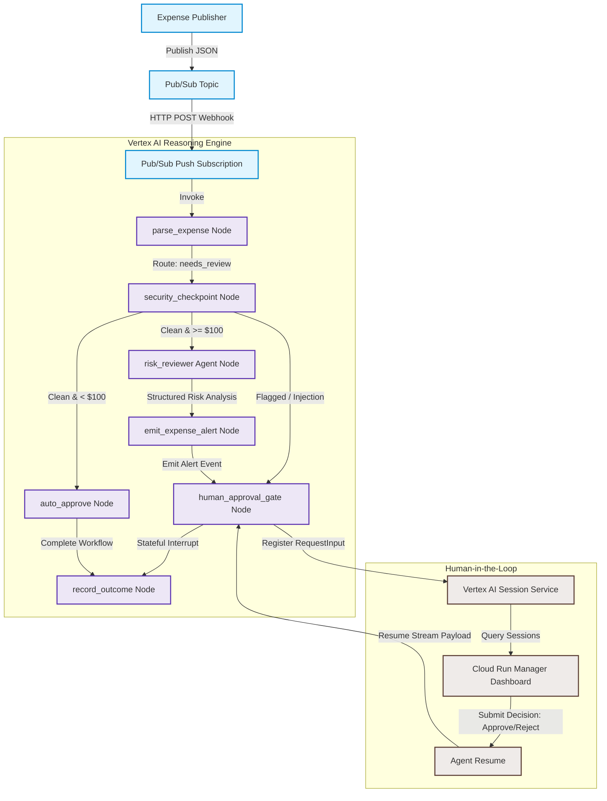

# Ambient Expense Agent — Production-Grade Event-Driven Workflow
## Day 5 Capstone Project Report

This project implements a security-first, event-driven, and fully automated **Ambient Expense Agent** for parsing, auditing, and routing employee expense claims. Deployed to the managed **Google Vertex AI Agent Runtime**, this agent seamlessly integrates automated policy validation, threat mitigations, and asynchronous **Human-in-the-Loop (HITL) approvals**.

---

## Overview

Modern organizations require automated workflows to process operational requests quickly while maintaining strict financial and security boundaries. The **Ambient Expense Agent** acts as an autonomous auditor, built using the **Google Agent Development Kit (ADK)**.

The system implements a tiered review process:
1. **Low-Value Auto-Approval**: Clean claims under $100 are automatically approved.
2. **High-Value Escalation**: Claims of $100 or more are evaluated for risks by an AI agent and routed to a manager for manual approval.
3. **Security Interception**: Malicious payloads or prompt injection attacks are caught, sanitized, and immediately routed to a human reviewer to prevent automated exploit execution.

---

## Architecture

The system utilizes an asynchronous, event-driven, graph-based routing architecture that bridges message queues, ML inference engines, and web applications.

### End-to-End Flow Diagram


### Flow Sequence
1. **Expense Publisher**: Publishes an expense payload (base64-encoded or raw JSON).
2. **Pub/Sub Topic**: Ingests and propagates the expense event.
3. **Pub/Sub Push Subscription**: Delivers the message via HTTP POST to the agent's web endpoint.
4. **Agent Runtime**: Normalizes the payload and initiates the ADK workflow graph.
5. **Session Service**: Persists execution state and tracks active interrupts.
6. **Cloud Run Dashboard**: Managers inspect pending requests and session histories.
7. **Manager Decision**: The manager approves or rejects the claim via the UI.
8. **Agent Resume**: The dashboard resumes the execution thread statefully via Vertex AI.

---

## Key Features

* **Event-Driven Integration**: Normalizes incoming Pub/Sub push payloads dynamically into unified internal representations.
* **Tiered Dollar Limits**: Processes claims under $100 immediately while routing larger amounts to managers.
* **Interactive Event Streaming**: Uses `ctx.write_event` to emit structured cards and risk notifications directly into the streaming logs.
* **Stateful Interrupts**: Employs ADK's native `RequestInput` (`adk_request_input`) to halt execution statefully, awaiting a manager response without maintaining an external database.
* **Managed Serverless Deployments**: Built on Google Cloud Run and Vertex AI Agent Runtime to scale dynamically from zero.

---

## Security Enhancements

Initial prototypes bypassed security scans for low-value expenses to optimize performance. However, this left a vulnerability where malicious inputs (e.g., prompt injections trying to force auto-approval or leak environment variables) could bypass checks entirely.

We implemented a **Security-First Paradigm** to eliminate these risks:
* **Mandatory Pre-Routing Security Scan**: Every expense claim runs through the `security_checkpoint` node *before* any routing or financial threshold decision takes place.
* **Prompt Injection Defenses**: The input is scanned against instruction-override heuristics. Flagged claims bypass LLM processing entirely and route straight to `human_approval_gate` to prevent jailbreak exploits.
* **PII Redaction**: SSN patterns and Credit Cards (validated via the Luhn checksum algorithm) are dynamically masked (`[REDACTED SSN]`, `[REDACTED CREDIT CARD]`) before being processed by LLMs.
* **Pub/Sub Safety Wrappers**: The `process_expense` and `query` methods inside [agent_runtime_app.py](file:///f:/Studyspace/AI_Agents_5_Day_Google/day05/ambient-expense-agent/expense_agent/agent_runtime_app.py) validate inputs and ensure that attackers cannot manipulate payload properties or bypass security gates.

---

## Human-in-the-Loop Approval Workflow

The human approval workflow uses ADK's stateful pausing mechanisms:
1. When a claim requires human review (amount $\ge \$100$ or flagged by the security checkpoint), the `human_approval_gate` node yields a `RequestInput(interrupt_id="human_decision")`.
2. The agent pauses execution, preserving the conversation history and state variables.
3. Once the manager submits a decision on the dashboard, the system invokes `agent.async_stream_query` (or `streamQuery`) to deliver the decision text (`"approve"` or `"reject"`).
4. The agent reads the input from `ctx.resume_inputs`, routes the flow to `record_outcome`, and completes the transaction.

---

## Manager Dashboard (Cloud Run)

The **Manager Expense Approval Dashboard** is a FastAPI service designed to run on **Google Cloud Run**. It connects directly to the **Vertex AI Session Service** to manage pending tasks:
* **Session Discovery**: Queries the Session Service using `list_sessions` and `get_session` to identify executions waiting for the `human_decision` interrupt.
* **Details Viewer**: Displays the parsed expense fields, redacted categories, and structured AI risk reports (risk scores and explanations).
* **Resume Operations**: Resumes the workflow by posting the manager's decision back to the agent runtime.

---

## Pub/Sub Event Pipeline

The ingestion pipeline handles raw messages in standard Pub/Sub envelope structures:
* **Normalization Middleware**: Intercepts webhook requests at `/trigger/pubsub`, normalizes subscription naming, and extracts base64 payloads safely.
* **Seamless Direct Queries**: The endpoint maps to the Reasoning Engine's `:query` and `process_expense` operations, allowing standard HTTP requests to trigger the identical workflow.

---

## Agent Runtime Deployment

The agent is registered with the **Gemini Enterprise Agent Registry** and deployed as a managed Vertex AI Reasoning Engine:

| Parameter | Deployed Value |
| :--- | :--- |
| **Reasoning Engine Resource ID** | `projects/172600545145/locations/us-east1/reasoningEngines/5300842314531340288` |
| **Endpoint URL** | `https://us-east1-aiplatform.googleapis.com/v1/projects/ai-agents-course-499804/locations/us-east1/reasoningEngines/5300842314531340288` |
| **Service Account** | `service-172600545145@gcp-sa-aiplatform-re.iam.gserviceaccount.com` |
| **Model** | `gemini-2.5-flash` |
| **GCP Project** | `ai-agents-course-499804` |
| **GCP Region** | `us-east1` |

---

## End-to-End Testing

A robust test suite verifies the security checks, workflow routing, and dashboard operations.

```bash
uv run pytest
```

### Test Coverage Results
```text
============================= test session starts =============================
collected 21 items

tests\integration\test_agent.py ....                                     [ 19%]
tests\integration\test_agent_runtime_app.py ..                           [ 28%]
tests\unit\test_dummy.py .                                               [ 33%]
tests\unit\test_security.py ..............                               [100%]

====================== 21 passed, 24 warnings in 21.96s =======================
```

---

## Screenshots

The following screenshots illustrate the system components and verified execution states:

### 1. General Playground Comparison (Auto-Approval vs. Human Review Alert)

*Figure 1: Comparison between an auto-approved low-value claim (< $100) and an escalated high-value claim emitting a warning card and awaiting manager decision.*

### 2. Cloud Run Manager Dashboard

*Figure 2: The Manager Approval Dashboard web interface showing pending claims.*

### 3. Dashboard Session Details (Alice's Pending Expense Claim)

*Figure 3: Details screen showing Alice's pending claim with extracted amount, category, and AI-generated risk review.*

### 4. Attacker Session Pending Review (Prompt Injection Intercepted)

*Figure 4: A prompt injection attempt is successfully flagged by the security checkpoint, bypassing LLM assessment and routing directly to the human reviewer.*

### 5. Playground Approved Session

*Figure 5: Playground execution demonstrating a resumed workflow state successfully transition to Approved after human response.*

### 6. Playground Rejected Session

*Figure 6: Playground execution showing the final Rejected output state once a negative review decision is processed.*

---

## Lessons Learned

* **Fail-Secure Defaults**: Security checks must always represent the entry gate of a processing pipeline. Separating logic paths before cleaning data allows adversaries to bypass controls by injecting instructions into variables.
* **Stateful Interrupt Optimization**: ADK's `RequestInput` eliminates complex database logic for stateful workflows, making it simple to write applications that interact with human reviews.
* **Reasoning Engine Alignment**: In Reasoning Engine environments, ensuring the selected model (e.g., `gemini-2.5-flash`) is fully supported in the target GCP region (`us-east1`) is critical to avoid deployment errors.

---

## Future Improvements

* **GenAI-Based Security Analysis**: Replace regex heuristics with a specialized Gemini classifier node or Web Risk API integration to capture sophisticated semantic prompt injections.
* **Tiered Approval Limits**: Implement multi-level approval thresholds (e.g., manager approval for $\$100-\$1000$, and executive approval for claims $>\$1000$).
* **Dynamic Budgeting**: Integrate with enterprise ERP tools to dynamically cross-reference expense submissions against department budget balances.
