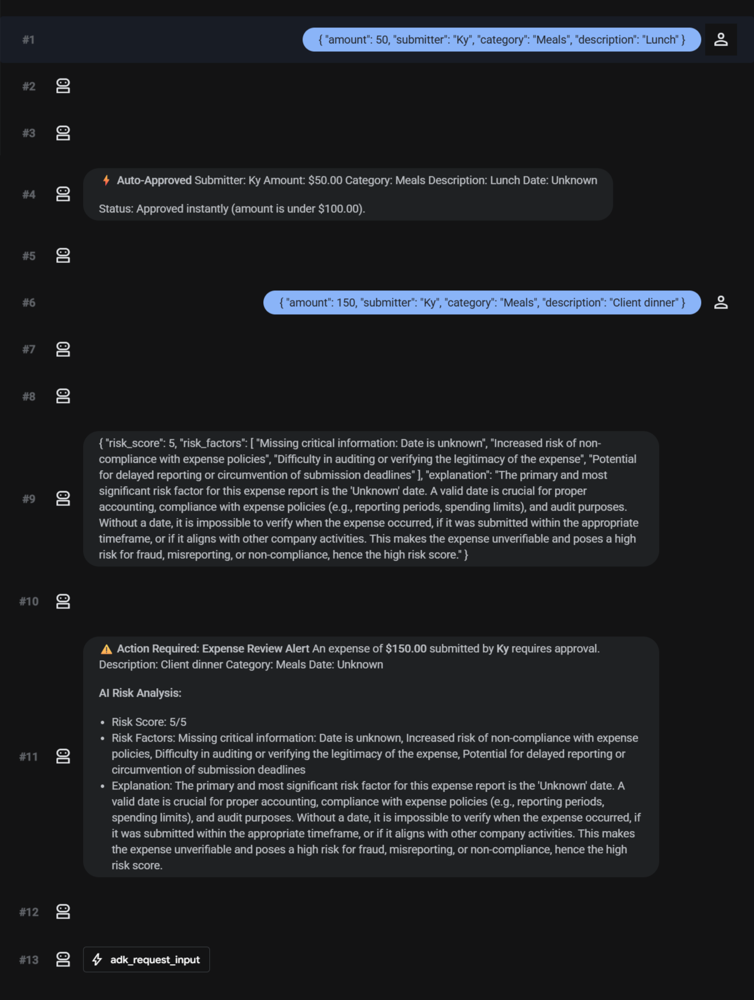

# Google & Kaggle AI Agents Intensive Course 2026
## Day 5: Production Deployment & Agent Runtime — Ambient Expense Agent

This repository contains the production-grade implementation of the **Ambient Expense Agent** built during Day 5 of the Google/Kaggle AI Agents Intensive Course. The project implements an automated, security-first expense claim processing agent deployed to the managed **Google Vertex AI Agent Runtime (Reasoning Engines)**.

---

## 1. Overview

The **Ambient Expense Agent** is designed to process and audit employee expense claims automatically. Operating under a security-first design, it parses incoming expense requests, scans for security vulnerabilities (e.g., prompt injections, malicious payloads, and PII leaks), assesses policy compliance, auto-approves low-risk claims under $100, and routes high-value or suspicious claims to a human reviewer.

This agent is built using the **Google Agent Development Kit (ADK)** framework and runs on **Vertex AI Agent Runtime**, enabling fully managed serverless scalability, automatic registry visibility, and seamless Human-in-the-Loop (HITL) execution.

---

## 2. Architecture

The system utilizes an event-driven, graph-based routing architecture. The agent's workflow transitions from raw input extraction to security sanitization, and then to either auto-approval or human audit.

```
                                    +----------------------+
                                    |  User Expense Input  |
                                    +-----------+----------=
                                                |
                                                v
                                    +-----------+----------+
                                    |    parse_expense     |
                                    +-----------+----------+
                                                | (always)
                                                v
                                    +-----------+----------+
                                    |  security_checkpoint |
                                    +-----+-----------+----+
                                          |           |
                        [Clean & < $100]  |           | [Clean & >= $100] OR [Flagged/Suspicious]
                                          |           |
                                          |           +-----------------------+
                                          v                                   v
                                  +-------+--------+                 +--------+-------+
                                  |  auto_approve  |                 | risk_reviewer  |
                                  +-------+--------+                 +--------+-------+
                                          |                                   |
                                          |                                   v
                                          |                          +--------+-------+
                                          |                          |  emit_alert    |
                                          |                          +--------+-------+
                                          |                                   |
                                          |                                   v
                                          |                          +--------+-------+
                                          |                          |  human_gate    |
                                          |                          +--------+-------+
                                          |                                   |
                                          |                                   v
                                          +----------------> [End] <----------+
```

---

## 3. Workflow Diagram (ASCII)

Below is the structured state transition path implemented in `expense_agent/agent.py`:

```text
Claim Input
    |
    v
[parse_expense] ──(needs_review)──> [security_checkpoint]
                                             │
                       ┌─────────────────────┼─────────────────────┐
                       │ (Clean & < $100)    │ (Clean & >= $100)   │ (Flagged / Injection)
                       v                     v                     v
                [auto_approve]        [risk_reviewer]     [human_approval_gate]
                       │                     │                     │
                       │                     v                     │
                       │            [emit_expense_alert]           │
                       │                     │                     │
                       │                     v                     │
                       └─────────────> [human_approval_gate] <─────┘
                                             │
                                             v
                                        Final Decision
```

---

## 4. Key Features

*   **Automated Parsing**: Uses LLMs to reliably extract structured fields (Amount, Submitter, Category, Description, Date) from free-form natural language inputs.
*   **Security Sanitization**: Prompt injection detection and PII checks occur on all transactions.
*   **Tiered Authorization Limits**: Under $100 claims are processed immediately, while claims of $100 or greater require human review.
*   **Human-in-the-Loop (HITL) Interruption**: Utilizes ADK's `RequestInput` mechanism (`adk_request_input`) to halt execution statefully, prompt the reviewer, and resume based on the decision.
*   **Warning Interface Cards**: Explicitly fires user-visible warnings using `ctx.write_event` prior to halting, improving visual feedback in client applications.
*   **Managed Serverless Runtime**: Deployed directly to Vertex AI Agent Runtime (Reasoning Engines) for auto-scaling and zero idle cost.

---

## 5. Security Improvements

In initial designs, low-value expenses (< $100) bypassed the security checkpoint and went directly to auto-approval, leaving the system vulnerable to prompt-injection exploits designed to force approval or leak data.

We refactored the workflow to follow a **security-first** pattern:
1.  **Mandatory Security Scans**: Every claim is routed through `security_checkpoint` before any routing decision is made.
2.  **Prompt Injection Guard**: Detects adversarial inputs (e.g., instructions attempting to override the $100 limit) and forces routing to the `human_approval_gate` with a flagged security status.
3.  **Sanitization Check**: Validates and logs clean/unsafe metrics prior to deciding on approval paths.

---

## 6. Deployment Process

The deployment is packaged and uploaded using the Google `agents-cli` pipeline:

1.  **Configure Project and Region**:
    ```bash
    gcloud config set project ai-agents-course-499804
    gcloud config set compute/region us-east1
    ```
2.  **Execute Deployment**:
    ```bash
    agents-cli deploy --project=ai-agents-course-499804 --region=us-east1 --no-confirm-project
    ```
3.  **Deployment Staging**: The CLI packages the source packages as an in-memory tarball, auto-generates requirements, uploads the bundle to Google Cloud storage, and updates the managed Vertex AI Reasoning Engine.

---

## 7. Production Validation

Validation of the deployed agent was conducted by running remote queries against the Vertex AI endpoint:

*   **Low-Value Request (< $100)**: Clean $50 claims correctly run through `security_checkpoint` and transition directly to `Auto-Approved`.
*   **High-Value Request (>= $100)**: Clean $150 claims pass `security_checkpoint`, invoke the `risk_reviewer` using `gemini-2.5-flash`, emit the warning alert card, and yield control to the human reviewer.
*   **Injection Attempt**: Suspicious inputs trigger an immediate flag and route directly to the human reviewer for rejection.

---

## 8. Agent Runtime Deployment Details

| Parameter | Deployed Value |
| :--- | :--- |
| **Reasoning Engine Resource ID** | `projects/172600545145/locations/us-east1/reasoningEngines/5300842314531340288` |
| **Endpoint URL** | `https://us-east1-aiplatform.googleapis.com/v1/projects/ai-agents-course-499804/locations/us-east1/reasoningEngines/5300842314531340288` |
| **Service Account** | `service-172600545145@gcp-sa-aiplatform-re.iam.gserviceaccount.com` |
| **Model** | `gemini-2.5-flash` |
| **GCP Project** | `ai-agents-course-499804` |
| **GCP Region** | `us-east1` |

---

## 9. Agent Registry Verification

The agent automatically registers with the **Gemini Enterprise Agent Registry** on deployment. This was verified by inspecting the fleet registry endpoint:

```json
{
  "name": "projects/ai-agents-course-499804/locations/us-east1/agents/agentregistry-00000000-0000-0000-f305-3625bf3f23c4",
  "agentId": "urn:agent:projects-172600545145:projects:172600545145:locations:us-east1:aiplatform:reasoningEngines:5300842314531340288",
  "displayName": "ambient-expense-agent",
  "protocols": [
    {
      "type": "CUSTOM",
      "interfaces": [
        { "url": "https://us-east1-aiplatform.googleapis.com/v1/.../reasoningEngines/5300842314531340288:query" },
        { "url": "https://us-east1-aiplatform.googleapis.com/v1/.../reasoningEngines/5300842314531340288:streamQuery" }
      ]
    }
  ]
}
```

---

## 10. Testing Results

An extensive unit and integration test suite verifies the updated routing configurations, security checks, and node integrations.

```bash
uv run pytest
```

Output:
```text
============================= test session starts =============================
collected 21 items

tests\integration\test_agent.py ....                                     [ 19%]
tests\integration\test_agent_runtime_app.py ..                           [ 28%]
tests\unit\test_dummy.py .                                               [ 33%]
tests\unit\test_security.py ..............                               [100%]

====================== 21 passed, 24 warnings in 21.96s =======================
```

---

## 11. Screenshots

Here is the visual validation of the two primary routing cases in the Vertex AI Agent Engine Playground:

### Two Test Cases (Auto-Approval vs. Human Review Alert)

*(Placeholder: Upload screenshot showing (1) Auto-approval for clean <$100 claim, (2) Emitted Warning Card & human decision input prompt for >=$100 claim.)*

---

## 12. Lessons Learned

*   **Fail-Secure Topology**: Avoid routing shortcuts for low-value transactions. Bypassing security checks to reduce execution costs leaves the system vulnerable to prompt-injection attacks. Security scanning must always be the entry point.
*   **Vertex AI Model Availability**: The default SDK template configured `gemini-3.1-flash-lite`, which is not available in the `us-east1` region for Vertex AI Reasoning Engines. Changing the model to `gemini-2.5-flash` resolved 404 deployment errors.
*   **Stateful Interrupts**: ADK's `adk_request_input` enables clean execution pausing, allowing developers to implement Human-in-the-Loop patterns easily without maintaining external state databases.

---

## 13. Future Improvements

*   **LLM-Based Security Check**: Replace regex-based prompt-injection heuristics in the security checkpoint with a specialized GenAI classifier or Google Cloud Web Risk API integration.
*   **Multi-Level Thresholds**: Implement tiered human review (e.g., manager approval for claims $\ge \$100$ and director approval for claims $\ge \$1000$).
*   **Persistent Storage Integration**: Swap `InMemorySessionService` with `VertexAiSessionService` to persist pending human decisions across application restarts.
